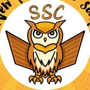

# 🧪 SMAVO Science Club (SSC)

Selamat datang di repositori resmi **SMAVO Science Club (SSC)** SMAN 2 Cibinong. Kami adalah wadah bagi siswa-siswi yang memiliki minat besar dalam eksplorasi sains dan pengembangan teknologi.

## 🔭 Visi Kami
Menjadi pusat inovasi dan riset siswa di SMAVO, mengintegrasikan pemahaman sains tradisional dengan kemajuan teknologi digital.

## 🏛️ Divisi Kami
Kami terdiri dari beberapa spesialisasi yang saling berkolaborasi:
- **Komputer & Informatika**: Fokus pada pemrograman, algoritma, dan web development
- **Fisika & Astronomi**: Eksplorasi hukum alam dan benda langit.
- **Biologi & Kimia**: Riset laboratorium dan pemahaman makhluk hidup.
- **Kebumian & Geografi**: Studi mendalam tentang sistem bumi.

## 💻 Proyek Utama
Saat ini kami sedang mengembangkan:
* **Official SSC Website**: Hub informasi terpusat untuk seluruh anggota dan dokumentasi kegiatan.
* **Resources Repository**: Kumpulan materi latihan OSN dan modul pembelajaran internal.

## 🤝 Mari Berkolaborasi
Kami percaya bahwa ilmu pengetahuan akan berkembang lebih pesat melalui kolaborasi terbuka. Kami mengundang siapa pun—baik siswa, alumni, mentor, maupun pengembang dari seluruh dunia—untuk berkontribusi dalam proyek kami.

- **Ingin berkontribusi kode?** Silakan cek repositori kami dan kirimkan *Pull Request*.
- **Punya ide proyek sains?** Mari diskusikan melalui *Issues* atau hubungi kami.
- **Resources & Education**: Kami terbuka bagi siapa saja yang ingin berbagi materi olimpiade (OSN) atau tutorial teknologi untuk membantu sesama pembelajar.
---
**SMAN 2 Cibinong** *Berahlak mulia, tangguh, dan kreatif*
